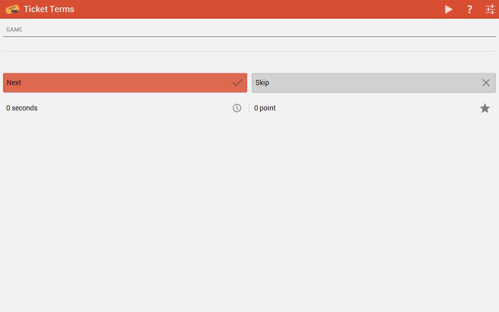

# ticket-terms
A small game I built as a Chrome App and uploaded to the [Chrome Web Store](https://chrome.google.com/webstore/detail/ticket-terms/ngdpjkojkhbnmbnpjlmegdihcbabclne).

> Can you guess the ticket terms?
> 
> In this small party game based on Password and Catchphrase, 
> players must work together to earn as many points as they can. 
> When the game begins, a word from the dictionary will be displayed on the screen. 
> Your friends need to guess what word is on the screen, without looking. 
> You can give hints, but don't say the word!

